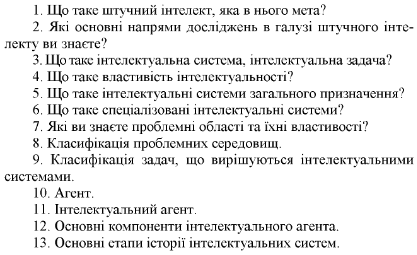
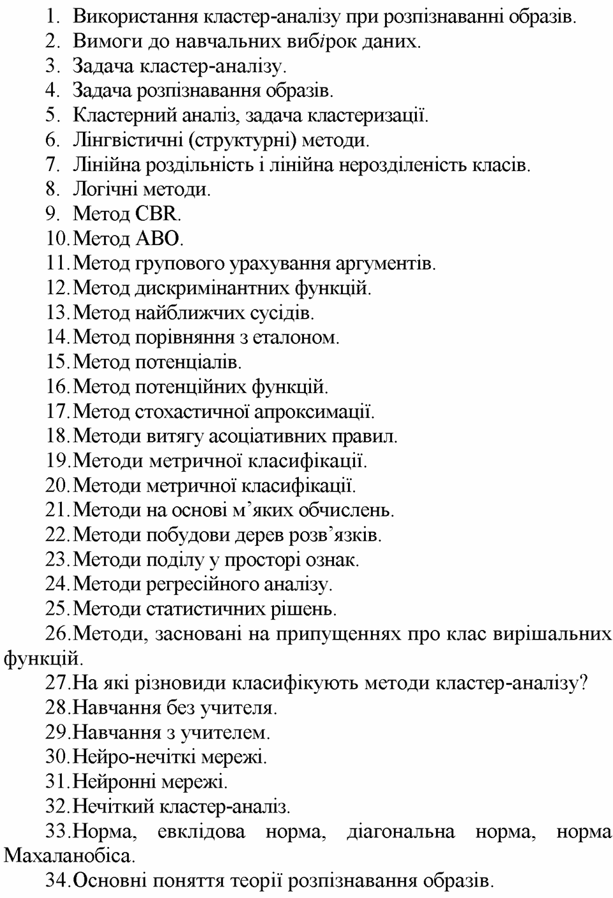
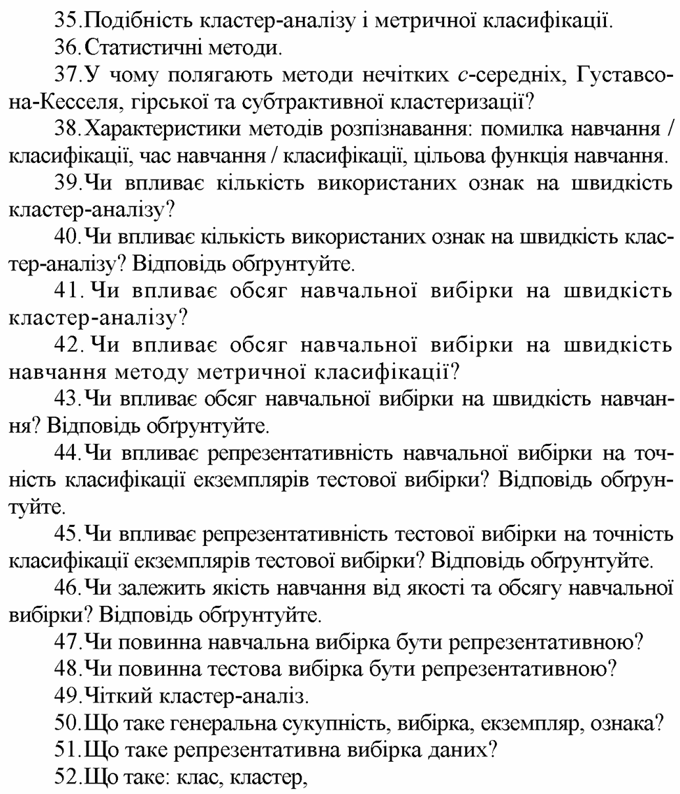
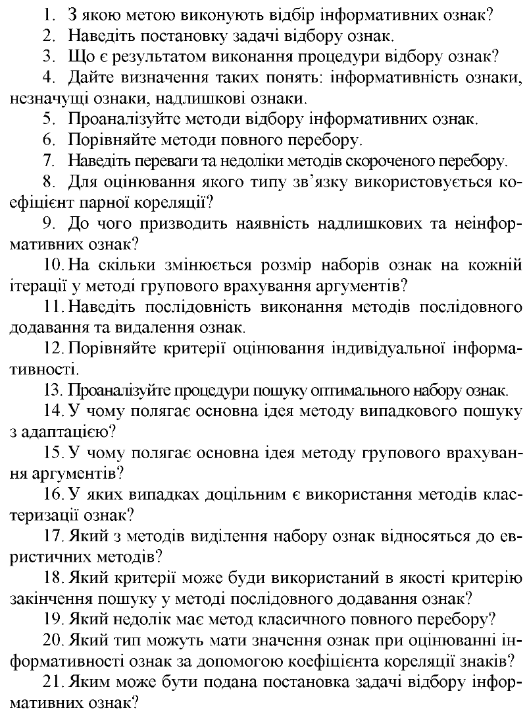
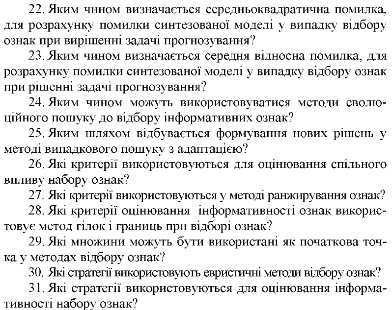
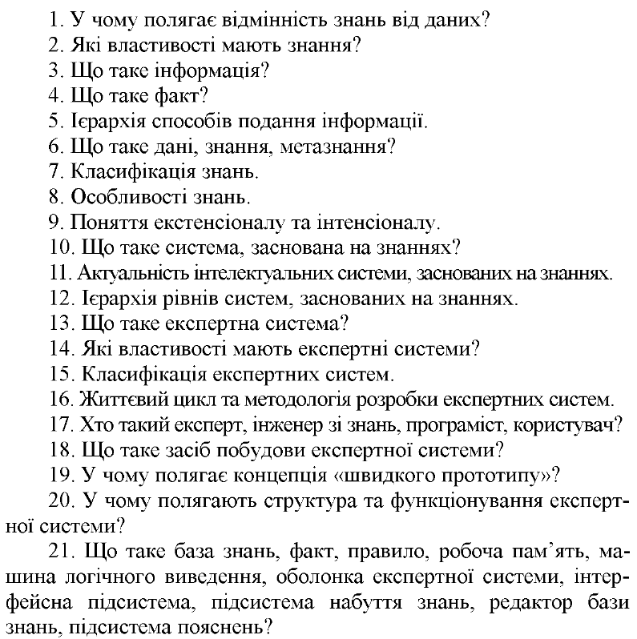
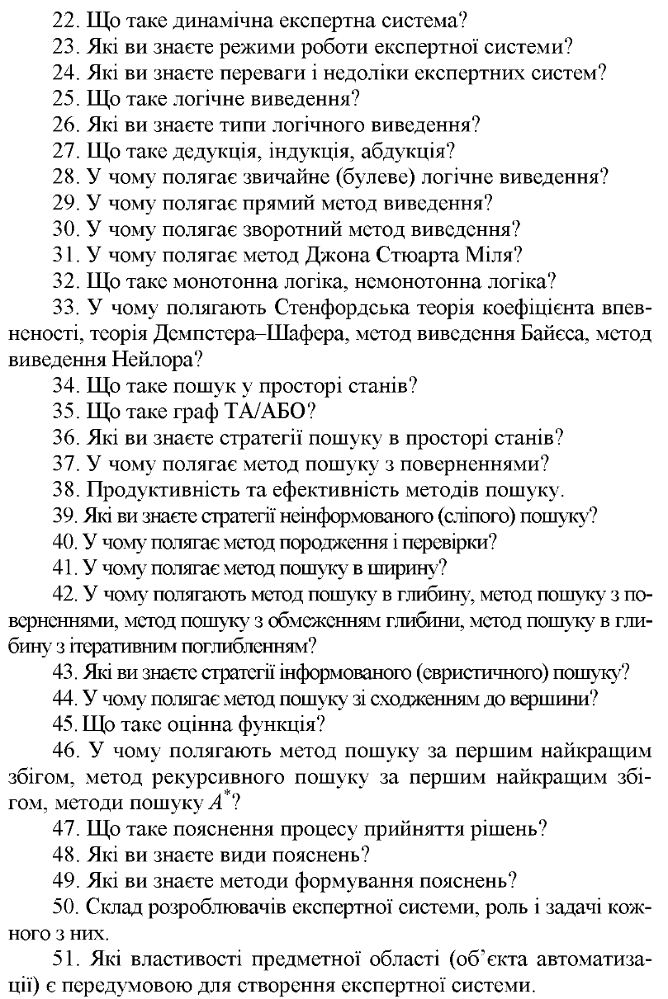
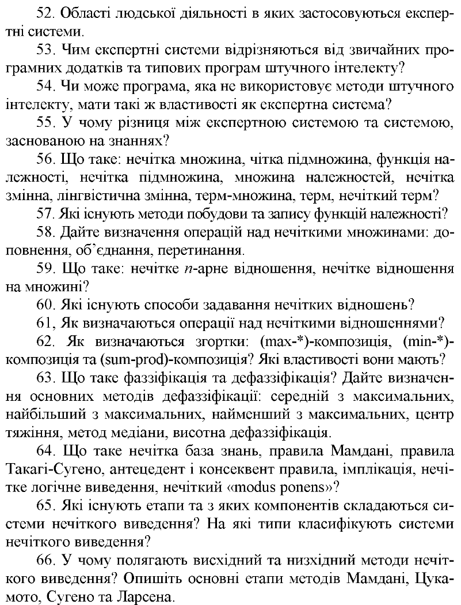

## 1. Основні поняття штучного інтелекту, сторінка 21

1. Що таке штучний інтелект, яка в нього мета? --- галузь комп. наук. мета -- розробка систем які мають людські можливості
2. Які основні напрями дослідження в галузі штучного інтелекту ви знаєте? --- подання знань, робота з ними, планування доцільного поводженн, спілкування людини з ЕОМ, розпізнавання образів та навчання
3. Що таке інтелектуальна система, інтелектуальна задача? --- система -- вирішує інтелектуальні задачі. задача -- точний алгоритмізований спосіб вирішення якої апріорі невідомий
4. Що таке властивість інтелектуальності? --- властивість що відрізняє інтелектуальні системи від інших. наявність моделі зовнішнього світу; здатність поповнювати знання; здатність виділяти значні якісні характеристики ситуації; здатність до дедуктивного виведення, генерації рішень; здатність прийняття рішень на основі неточної інформації; еволюція та адаптація.
5. Що таке інтелектуальні системи загального призначення? --- вирішують усі задачі
6. Що таке спеціалізовані інтелектуальні системи? --- вирішують лише кілька задач
7. Які ви знаєте проблемні області та їхні властивості? --- медицина, агрокультура
8. Класифікація проблемних середовищ? --- повністю або частково спостережні; детерміновані (наступний стан визначається поточним та дією) або стохастичні; епізодичне або послідовне; статичне або динамічне або напівдинамічне; дискретне або неперервне; одноагентне або мультиагентне.
9. Класифікація задач, що вирішуються інтелектуальними ситемами? --- за ступенем зв'язності -- зв'язні які не можна поділити на підзадачі, малозв'язні задачі які можна поділити на підзадачі; статичні чи динамічні; за класом вирішувальних задач -- задачі розширення та довизначення, перетворення
10. Агент? --- сутність для вирішення задач з цілеспрямованим поводженням. взаємодіє з зовнішнім світом
11. Інтелектуальний агент? --- який навчається і розвивається; пристосовується до дій; швидко навчається великому обсягу інформації; модель пам'яті віку
12. Основні компоненти інтелектуального агента? --- сенсори, критик (оцінює ефективність дій), виконавець, виконавчі механізми
13. Основні етапи історії інтелектуальних систем? --- 3 тисячоріччя до Христа (перша база знань), 1 тисячоріччя до Христа (статуї), 940 років до Христа, 384 роки до Христа (Аристотель описав силогізм), 10 років після Христа (Герон створив), 260 років після Христа (про категоризацію знань і логіку)

## 2. Розпізнавання образів, сторінка 58

1. Використання кластер-аналізу при розпізнаванні образів ---
<<<<<<< HEAD
2. Вимоги до навчальних вибірок даних ---
3. Задача кластер-аналізу --- розбити об'єкти з Х на декілька кластерів
4. Задача розпізнавання образів ---
5. Кластерний аналіз, задача кластеризації ---
=======
2. Вимоги до навчальних вибірок даних --- її репрезентативність. Всі типові екземпляри подані у генеральній сукупності мають бути і у вибірці
3. Задача кластер-аналізу --- розбиття вибірки на кілька кластерів, у яких об'єкти більш схожі між собою
4. Задача розпізнавання образів --- апроксимація залежності, визначенні для екземпляру Х значення вихідної ознаки У на основі функції У=Ф(Х)
5. Кластерний аналіз, задача кластеризації --- технологія, що дозволяє розділити вхідні дані на класи (групи однотипних екземплярів) або кластери (компактні області екземплярів)
>>>>>>> 64aa1cf1eb6e111c0afbe13003a3e05adbea5978
6. Лінгвістичні (структурні) методи ---
7. Лінійна роздільність і лінійна нероздільність класів --- лінійно роздільні це такі класи де можна екземпляри розділити однією гіперплощиною щоб по один бік від неї були екземпляри одніого класу а по другий іншого, без змішування
8. Логічні методи ---
9. Метод CBR --- використовує явні функції подібності, визначені на основі відстані
10. Метод ABO --- заснований на обчислені пріоритетів, що характеризують близкість розпізнаваного й еталонного об'єктів за системою ансамблів ознак, що являє собою систему підмножин заданої множини ознак
11. Метод групового урахування аргументів ---
12. Метод дискримінантних функцій ---
13. Метод найближчих сусідів ---
14. Метод порівняння з еталоном ---
15. Метод потенціалів ---
16. Метод потенційних функцій ---
17. Метод стохастичної апроксимації ---
18. Методи витягу асоціативних правил ---
19. Методи метричної класифікації ---
    1. фаза навчання -- задана вибірка Х,У де У належить множині (1, 2, ..., К) де К кількість класів. знайти координати центрів класів -- еталонів, середніх екземплярів. повернути множину центрів класів В
    2. фаза розпізнавання -- задати екземпляр Х та множину центрів класів В. знайти відстань від екземпляра до кожного класу. віднести екземпляр до класу, еталон якого є найближчим.
    3. якщо відстань однакова:
       1. відмовити від розпізнавання
       2. віднести до класу де більше екземплярів
       3. віднести до класу де потенційна втрата для віднесення є найменшою.
20.
21. Методи на основі м'яких обчислень ---
22. Методи побудови дерев розв'язків ---
23. Методи поділу у просторі ознак ---
24. Методи регресійного аналізу ---
25. Методи статистичних рішень ---
26. Методи, засновані на припущеннях про клас вирішальних функцій ---
27. На які різновиди класифікують методи кластер аналізу --- чіткі та нечіткі
28. Навчання без учителя --- коли у вибірці немає вихідної ознаки У
29. Навчання з учителем --- коли у вибірці є вихідне значення У
30. Нейро-нечіткі моделі ---
31. Нечіткий кластер аналіз ---
32. Норма, евклідова норма, діагональна норма, норма Махаланобіса ---
33. Основні поняття теорії розпізнавання образів ---

Що таке клас
що таке кластер
різниця між ними
метод еталонів
Що таке класифікація?
Що таке регресія? Це задача оцінювання, коли ознаки є неперервними.
Що таке розпізнавання образів? Це задача стрктурно-параметричного синтезу або класифікації, коли ознзаки є дискретними.

## 3. Відбір інформативних ознак, сторінка 115

## 4. Інтелектуальні системи, засновані на знаннях, сторінка 189

