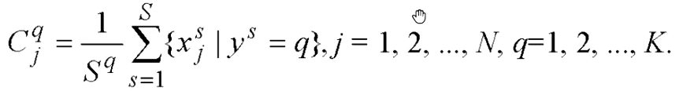
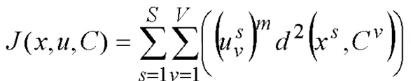
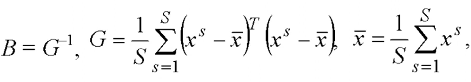

## 1. Основні поняття штучного інтелекту, сторінка 21

- ШІ галузь комп наук
  - займається автоматизованим поводженням агентів
- агент це сутність яка виконує дії в предметній області
  - розумна поведінка це коли мінімізує поведінка якісь функції
- мета -- навчити комп стати подібним до людини
- інтелектуальна система вирішує інтелект. задачі
  - кібернетична система
- інтелектуальна задача це коли точний алгоритм невідомий
- напрямки роботи штучного інтелекту
  - подання знань і робота з ними
    - є знання людей
    - їх застосувати для рішення задач
    - або автоматичне виділення знань, які вже виражені, описані
  - обробка даних та витягування знань з даних
  - планування доцільного поводження
    - задати глобальну мету
    - планувати має задачу щоб знизити якісь фактори
    - коли треба багато вирішити проблем теж задача планування
  - спілкування людини з компом
    - для непрограмуючого користувача треба вказівки компу
    - або від нього отримати дані
  - акти розпізнавання і навчання
- будь яка система інтелектуальна працює в предментій (проблемній) області
  - частина світу, яка містить всі деталі
  - складається з інформаційних об'єктів
- людиноподібні дії це ідеї які призвели до виникнення ШІ
- створення компів та персональних компів зробила що більше досліджень в цьому
- компу питання задати, і коли йде розпізнавання змісту
  - і пошук не просто за ключовими словами
  - то це вже семантичний пошук, це штучний інтелект
- є ШІ багато де
  - розпізнавання мови
  - інтелектуальні чати
  - розпізнавання тексту
  - анотації зображень та відео, опис зображень
  - синтез -- зображення чи відео за текстом
- квантові обчислення може оптимізацію інтелектуальних систем пришвидшити їх

ШІ - галузь комп наук
займається автоматизацією розумної поведінки агентів
агент робить дії, впливає на світ
він сприймає інформацію зовні
поведінка цілеспрямована => розумна

основні напрями досліджень ШІ:

1. подання знань і робота з ними
   використання даних
   витягання знань з даних
2. планування цілеспрямованого поводження
   задати мету, за нею планує програма
   задача планування
3. спілкування людини з компом
   як передати вказівки компу
4. розпізнавання образів й навчання

інтелектуальна система -- кібернетична для рішення інтелектуальних задач
інтелектуальна задача -- точний алгоритм заздалегідь не відомий
рішення задачі -- діяльність для досягнення мети
отримати результат задачі це і є рішення

властивість інтелектуальності - відрізняє інтелектуальну від інших систем:

1. наявність внутрнішньої моделі світу
2. здатність поповнення знань
3. аналіз ситуацій
4. генерація рішень
5. здатність приймати рішення
6. адаптивність моделі

за сферою застосування є загального призначення і спеціальні.

будь яка інтелектуальна система є в предметній області
має мати всі складові для вирішення задачі
кожна предметна область має сутності (об'єкти, їх описи)
сутності мають асоціації між собою
клас сутностей -- це сукупність подібних сутностей

інтелектуальний агент -- адекватно виконує вимоги

раціональний агент -- максимізує значення продуктивності (враховує минулі рішення)

## 2. Розпізнавання образів, сторінка 58

- головне це математика яка тут
- реалізувати і вміти використовувати її це головна мета курсу
- готові реалізації можна використовувати
- розпізнавальні системи тепер
  - вони мають дані від сенсорів
  - на виході дати категорію (клас, мітку) куди віднести образ
  - іноді на виході це кількісне значення
  - задачі категорій є задача класифікації (розпізнавання)
  - задачі отримання кількості -- задачі оцінювання (регресії)
- генеральна сукупність
  - множина всіх об'єктів визначеного типу
  - вся множина автомобілів називається генеральною сукупністю
  - тоді об'єкт з генеральною сукупності це екземлпяр
- множина об'єктів з генеральної сукупності є **вибіркою**
- екземпляри (об'єкти) генеральної сукупності описуються ознаками (атрибутами, властивостями)
  - можна занести у комп лише інформаційний опис об'єкту
- екземпляр іноді це сам об'єкт або його опис
  - представлений набором ознак об'єкту
  - напириклад автомобіль має висоту ширину, кільксть дверей
    - це атрибути які описують об'єкти
  - значненя ознак для кожного об'єкта будуть різні
  - ознака це властивість об'єкту
  - для кожного об'єкту ознака буде мати кожне значення окреме
  - підмножина кінцевого розміру це вибірка
    - кінцева підмножина екземплярів генеральної сукупності
- задача розпізнавання
  - хоче дослідити залежності для прийняття рішень чи прогнозування
  - як курс валюти залежить від чогось, щоб далі його передбачити
  - тоді якщо буде модель яка буде прогнозувати
- мета розпізнавання образів -- побудова математичної моделі
  - відмінно від інших областей знань в тому що ми не використовуємо людські знання з предмету
  - у фізиці людські знання
  - тут же немає людських знань
  - намагаємось за допомогою біоінспірованих підходів досягти подобу людині
  - не аналітично довести щось намагаємось
- є генеральна сукупність
  - складається з екземплярів
  - екземпляри описуються ознакми
  - вибірка це кількість екземлпярів з генеральної сукупності
- формальна постановка задачі
  - нехай задана вибірка спостережень <x,y>
  - характеризується ознаками, з нижнім індексом $x_j$
  - ознака $x_3$ це колір скажімо. це сама ознака, не її значення
  - по іншому
  - вибірка складається з екземплярів
  - екземпляр це верхній індекс $x^v$
  - перший авто це $x^1$
  - це сам екземпляр
  - кожен екземпляр є N ознак, кожен екземпляр характеризується ознакою
  - значення кольору для третього автомобіля $x^3_3$
  - $x_v$ це екземлря
  - $x^j$ це ознака
  - також кожному екземпляру є вихідна ознака $y^v$
  - вхідні ознаки це легковимірювані
  - вихідна ознака це яку треба спрогнозувати
    - на основі якихось приказок згенерувати відповідь
  - спостереження за системою це вхідні ознаки
  - а вихідна це клас -- діагноз, який дорого виміряти
- загальне визначення задачі апроксимації залежності
  - є екземпляр $x^v$
  - треба розрахувати модель залежності
  - $y$ це функція від $x$
  - вид функції не знаємо
  - але намагаємось замінити незнане відомою математичною формулою
  - вона за результатом має давати подібні значення реальності
  - апроксимація це заміняємо те що невідоме тим що відоме
  - курс валюти, показник гемоглобіну це задача оцінювання або регресії
    - це курс валют
    - відповідь -- 0.23 скажімо
  - коли ж $y$ має неперервні чи дискретні то це задача класифікації або розпізнавання образів
    - класи 1 2 3
    - тут категорій не дуже багато
  - в задачі розпізнавання образів треба отримати модель для $x$ видати номер класу
- клас це об'єднані об'єкти різними властивостями
  - клас це нав'язана людьми категорія
- екземпляри в просторі ознак по різному розташовані можуть бути
- найкраще коли класи компактні
  - це коли групка екземплярів фізично знаходяться в одном місці
  - там немає інших класів об'єктів
  - якщо змішані області тоді задача складніша і це некомпактні класи
- в багатьох методах працюють добре тільки якщо класи компактні
  - якщо вимагає то цей метод виходить з гіпотези про компактність класів
  - в більшості методів це не виконується
  - тому помилка буде в методах таких
- вибірки можна розділити на навчальну та тестову
  - навчальна це за якою будується модель
    - набір спостережень для системи щоб вона закономірності шукала
    - формувала модель, знайти її структуру і параметри
    - сам процес побудови моделі це навчання
  - тестова вибірка це для перевірки моделі
    - замість неї може бути використана навчальна
    - це погана практика
    - іноді треба одну і ту ж для навчання і розпізнавання використовувати
- розпізнавання образів це побудова моделі
- навчання це коли побудова моделі
  - даються приклади і за ними навчається людина
- процес розпізнавання це коли визначається не бачений раніше екземпляр
- навчальна вибірка має бути репрезентативною
  - тоді вона буде заміною генеральної сукупності при побудові моделі
  - якщо не буде репрезентативною то тільки певну множину буде представляти
  - вибірка має бути репрезентативною, щоб відбивала основні випадки генеральної сукупності
  - як це зробити?
    - обсяг -- чим більше вибірка тим більше шансу що потраплять туди викиди
    - треба якось зробити щоб більшість екземплярів зробилися у вибірці
  - якщо обрати мало людей то це не якісна вибірка
- правильніше буде від генеральної сукупності витягнути і навчальну і тестову
  - тестова вибірка теж краще щоб була репререзентативна
  - краще щоб ці вибірки були незалежними
- класифікація або оцінювання (регресія)
- задача побудови розпізнавальної моделі
  - навчання з учителем
  - ідентифікація моделі
  - структурно параметричний синтез
  - за вибіркою <x,y> отримати модель залежності $y$ від $x$
  - модель апроксимуємо модел'ю $y=f(w,x)$
  - $w$ це параметри
    - тут параметричний синтез
  - $f$ це структура
    - це структурний синтез
  - коли є $y$ то це навчання з учителем
  - щоб підібрати потрібні криетрії
- якщо не знаємо структури залежності ані значень параметрів
  - це чорна скриня
  - можемо бачити вхід та вихід
- якщо знаємо структуру залежності та параметри
  - це біла скриня
- помилка
  - для кожного екземпляру вихідну ознаку рахуємо
  - порівнюємо задане і прогнозоване
    - якщо не відрізняютьяс помилки нема
    - якщо відрізняються то це помилка
  - миттєва помилка це для одного екземпляру помилка
  - додаємо до суми одиницю якщо не збігаються класи прогнозовані та призначений
- тоді ймовірність помилки це помилка поділена на кількість екземплярів
- тоді ймовірність прийняття правильних це $1-помилка$
- різниця в квадраті береться і сумується
  - далі ділимо це на 2
  - $\frac{1}{2}\sum_{s=1}^S (y^s - f(x^s))^2 \rArr min$
  - двійка на початку через те що похідна використовується
- потрібна вибірка з генеральної сукупністю
- лінійна роздільність та нелінійна роздільність класів
- два класи є лінійно роздільні якщо однією лінією можна розділити класи
  - по один бік екземпляри одного класу, по другий іншого
  - це найпростіший варіант розпізнавання
- якщо нелінійно роздільні класи
- метод метричної класифікації
  - є вхідні ознаки
  - треба модель залежності вихідної від вхідних
  - вихідна ознака дискретна
  - метод еталонів
  - тут потрібні компактні класи
  - **еталон** це усереднений екземпляр класу
    - найбільш типовий об'єкт
  - фаза навчання
    - мета -- отримати модель
    - вхідна вибірка <x,y>
    - модель неявна
    - еталони - центри мас (точок) екземплярів
    - $C^q_j$ значення центра класу
    - $S^q$ кількість екземплярів у класі
    - 
    - сума $x^s_j$ якщо екземпляр до класу належить
    - це для кожної ознаки і для кожного класу
    - еталон це середнє мас точок екземплярів
    - результат -- сукупність еталонів $w$
    - тут тільки параметричне, структура неявно задана
  - фаза розпізнавання
    - евклідова відстань
    - відносити екземпляр до еталону якого класу найменша
    - якщо відстань до двох класів однакова
      - відмовитись від розпізнавання
      - відносити до класу де більше екземплярів
      - враховувати ціни перейменування
        - медична діагностика
        - якщо хворий або нехворий
        - тут ціни класів різні
        - якшр хворий то просто дослідженя
        - а якщо хворого віднести до здорової то це погано
        - якщо екземпляр і до здорових і до хворих то краще до хворих одразу
          - тоді просто обстеження додаткові
  - метод безпомилково проацює якщо компактні класи, і задача лінійно роздільна
- кластерний аналіз
  - кластеризація
  - розподіляє вхідні дани на класи (групи однотипних екезмплярів) або кластери (компактні групи)
  - неконтрольоване навчання -- навчання без учителя
  - чіткі та нечіткі методи класетризації
  - чіткі
    - кожен екземпляр належить тільки одному кластеру
  - нечіткі
    - ступінь належності
    - екземпляр належить до кожного кластеру зі ступенем належності
- клас
  - сукупність екземплярів одного типу
  - мають спільні властивості
  - вони відрізняють об'єкти від інших класів
  - може бути некомпактним
- кластер
  - завжди компактна область
- чіткий аналіз з додаванням класів
  - найменша кількість кластерів це кількість класів
- чіткий аналіз з видаленням класів
  - метод еталонів використовується
  - тут кількість еталонів == кількість кластерів
  - оцінюємо помилку
  - якщо помилка менше порога а кількість кластерів більша за кількість класів
- нечіткий кластер аналіз
  - це без учителя
  - $d^2$ це відстань між $x^s$ та $C^v$
  - 
  - $u^s_v$ це ймовірність
- fuzzy c means FCM
  - розбиття певне є на початку
  - далі поточне нечітку розбиття на першій ітерації
  - кластерів всього $V$
- норма
  - спосіб вимірювання відстані
  - евклідова норма
    - дорівнює 1 якщо i==j і 0 якщо i!=j
  - діагональна норма
    - виділяє кластери у вигляді гіпереліпсоїдів
    - орієнтовані вздовж координатних осей
  - норма махаланобіса
    - кластери можуть бути гіпереліпсоїди та у будь-яких напрямках
    - 
- машинне навчання це область ШІ яка автоматизує дані
- неконтрольоване навчання
  - навчання без учителя
  - розділити вибірку на різні групи
- індуктивне навчання
  - побудувати модель
- трансдуктивне навчання
  - відповідає навчальним та тестовим точкам даних, які вже спостерігала
- кластерний аналіз
  - неконтрольоване навчання
  - жорстка кластеризація
    - кожне об'єкт належить чи неналежить кластеру
  - м'яка кластеризація
    - нечітка кластеризація
- кластеризацяі на основі центроїдів
- FCM одна метрика
  - починає з певного початкового розбиття

лінійно роздільні це коли можна однією прямою (чи гіперплощиною) розділити елементи двох класів

системи інтелектуальні приймають дані від сенсорів
на виході має бути клас (класифікація)
або кількісне значення (регресія, оцінювання)

Генеральна Сукупуність це всі об'єкти якогось типу
множина уявна, всі автомобілі наприклад
звідти об'єкт називається екземпляром
підмножина ГС це вибірка

екземпляр (об'єкт ГС) має ознаки (властивості, атрибути)
екземпляром також може називатися сам об'єкт, його опис
множина ознак (атрибутів) -- назви властивостей
ознака це властивість, вона має різне значення
вибірка -- кінцева підмножина екземплярів типу

набір прикладів маємо
тоді на основі них треба щоб комп'ютер прогнозуваав далі
або
текст маємо багато сканів
тоді хочемо щоб комп'ютер міг співставити код із зображеням (або навпаки)

$x^s$ це сама ознака (її назва)
$j$, та $x^s_j$ це саме значення ознаки
також є вихідна ознака $y^s$

мета розпізнавання образів -- побудова розпізнавальної моделі
але тут юзаємо певні біоінспіровані підходи аби досягнути результату як людина

є генеральна сукупність
в ній є екземпляри
там є ознаки
якщо витягнули певні екземпляри -- це вибірка

нехай задана вибірка спостережень <x,y> (два вектори спільні)
набір $n$ ознак
$x_j$ це сам ознака, назва її
$j$ від 1 до $n$
або:
вибірка складається з $S$ екземплярів
$x^s$ це екземпляр
кожен екзмепляр має набір ознак, n штук
$x^s_j$ значення ознаки для екземпляру. значення кольору для авто: $x^3_3$
фактично це таблиця, де рядки це екземпляри, а стовпці -- ознаки

вихідна ознака $y^s$
ознаки бувають:
вхідні -- легкі
вихідні -- цільові
треба на основні вхідних прогнозувати цільові

спостереження курсу валюти за день, вхідні
розрахувати курс валюти на завтра, вихідна

апроксимація -- заміна невідомого на наближене обраховане

недискретна неперервна величина -- задача оцінювання (регресія)
якщо бінарна чи дискретна -- розпізнавання образів (класифікація)

для розпізнавання образів треба модель яка видасть клас
клас -- екземпляри зі схожими властивостями
компактний клас це коли класи не змішані між собою
якщо метод вимагає компактні класи то він виходить з теорії про компактність класів

об'єкт є унікальним
але можна якийсь клас вигадати

найкраще коли компактні класи
коли групка схожих екземплярів в одному місці є
тоді модель будувати легше

метод який виходить з гіпотези про компактність класів
структура та параметри моделі
навчання при розпізнаванні образів це просто побудовав моделі

навчальна вибірка -- на якій будується модель
показували зображення літер, казали що це літера А, то Б і так далі
навчальна вибірка це приклади
процес навчання це побудова моделі
і коли нова літера дається і кажемо яка це то це розпізнавання
навчальна вибірка має бути репрезентативною

тестова вибірка -- екземпляри для перевірки моделі
якщо потрібна модель, то повинна бути репрезентативності
модель має добре відображати випадки для генеральної сукупності

чим більше навчальна вибірка, тим краще репрезентативність

тестова вибірка це за якою обирається модель
якщо будувати модель і на ній тестувати це погана практика

тестова з навчальної і генеральної сукупності взяти
якщо не буде репрезентативна тестова теж не дуже
для навчальної потрібна репрезентативність

побудова структурно-параметричного синтезу, побудова моделі, ідентифікація
шукається структура f

f - функції
w - параметри функції
f задає вид функції

біла скриня це коли і структура моделі і значення параметрів.
що таке значення параметрів функції?

На основі функції помилки критерій оптимальності.
Помилка це $y^s - f(x^s)$. Вимірюємо ознаку, мінусуємо із зазначеною помилкою. Це для задач навчання з учителем.
Сукупна помилка. Для бінарних беремо абсолютне значення заданого значення мінус обрахованого.
Теж можна зараховувати 1 якщо вгадане значення не дорівнює заданому.

Щоб взнати ймовірність помилки треба оцю суму помилок поділити на кількість екземплярів у вибірці.
Якщо було 5 екземплярів які вгадані правильно, а всього 100 об'єктів, тоді ймовірніть 0.05 == 5/100.
Ймовірність правильного рішення 1-ЙмовірністьПомилки.
Тоді 1-0,05 == 0,95.

Помилка може бути/неБути або кількісна помилка миттєва.

Лінійно роздільні класи це коли є групка об'єктів і їх можна розділити однією гіперплощиною так, аби вони були всі окремі в групках.

- категоризація моделей
  - за типом одержуваної моделі

    - якісні -- одерувати одне з кінцевої множини рішень або оперувати дискретними даними
    - кількісні -- одержувати кількісну ознаку параметрів
  - за видом використаних знань

    - параметричні
    - непарааметричні
    - евристичні
  - за специфікою способу подання знань про ПО

    - інтенсіональні
    - екстенсіональні

$C_j^q = \frac{1}{S^q}\{x^s_j \| y^s = q\}, j=1,2,...,N, q=1,2,...,K.$

Навчання це коли для методу еталонів це ідентифікація центрів класів як середнє між всіма класами. Це фаза навчання.

Фаза розпізнавання це коли задається екземпляр і шукаємо відстань від нього до кожного еталону.

$R(x^s,C^q)=\sqrt{\sum_{j=1}^N (x_j^s-C^q_j)^2}, q=1,2,...,K.$

Відстань це близькість.

Відносимо екземпляр де відстань найменша.

$y^s = f(w,x^s) = \arg \min_{q=1,2,...,K}\{R(x^s,C^q)\}$

Якщо екземпляр подібний до кількох, тоді кілька способів:

1. відмова від розпізнавання
2. віднести до найближчого класу
3. враховувати ціну перейменування
   це якщо людина хвора. то якщо хвора дійсно то добре, а якщо ні то просто обстежити.

метод еталонів працює якщо задача лінійно роздільна область і є компактність класів.

чіткий кластер аналіз це коли без вихідної ознаки. чіткі методи кластеризації є два типи:

1. методи з нарощуванням (додаванням) кластерів
2. методи зі скороченням (редукцією) кластерів

метод пікового групування
визначити точки, які будуть центрами кластерів
для кожної визначити потенціал: чим більше екземплярів навкол, тим більший

fuzzy c means. обирається першопочаткове розбиття. потім метод перераховує кластерні центри.
закінчувати коли перевищено кількість ітерацій.
спочатку кількість кластерів задано.

## 3. Відбір інформативних ознак, сторінка 115

## 4. Інтелектуальні системи, засновані на знаннях, сторінка 189
