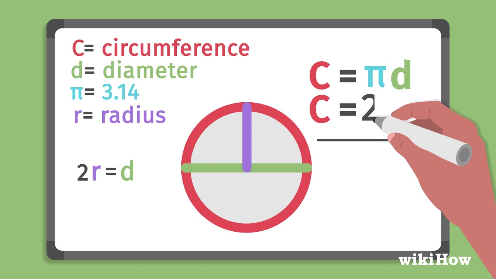

## Topic

GLAUCOMA DIAGNOSTICS BY MULTI WAVELET TRANSFORM

## Outline

whats glaucoma
how to diagnose them
what is multi wavelet transform
how to use it

## Formatting Examples

ПРОГРАМНА РЕАЛІЗАЦІЯ МЕТОДІВ АУДІОВІЗУАЛЬНОЇ СТИМУЛЯЦІЇ ГОЛОВНОГО МОЗКУ - http://bionics.nure.ua/issue/view/18527/11471

GLAUCOMA DIAGNOSTICS USING MACHINE LEARNING METHODS - http://bionics.nure.ua/issue/view/18949/11904

## Articles on the Topic

Arbitrary:

trig functions (cos tan ctg...) - https://byjus.com/maths/trigonometric-functions/
why plot functions - https://www.quora.com/What-is-the-importance-of-a-graph-of-a-function
plot in R - https://stackoverflow.com/questions/26091323/how-to-plot-a-function-curve-in-r

on glaucoma - https://www.aao.org/eye-health/diseases/what-is-glaucoma#diagnosis
on signals - https://x-engineer.org/signal/

## Text Draft

- glaucoma
  - is an umbrella term for many eye conditions
  - caused by eye strain
  - symptoms include
    - blurry vision
    - double vision
  - risks if not treated are
    - loss of sight
  - important to diagnose early because
    - has no clear symptoms at first
    - can lead to permanent blindness if not treated or stopped
- wavelet is
- wavelet vs multiwavelet
- how to apply multiwavelet
