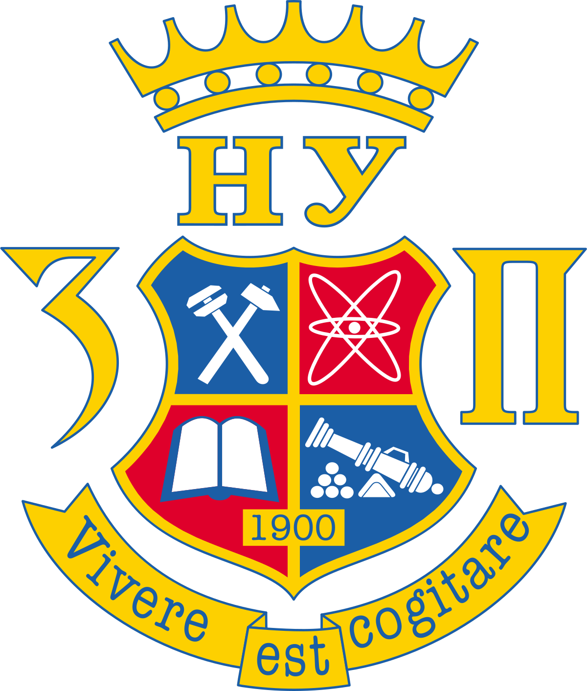
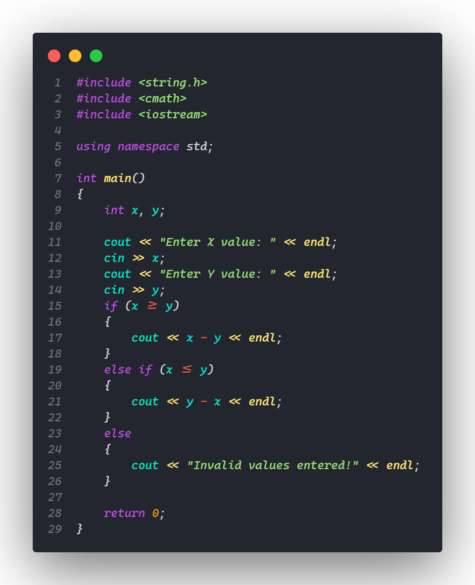
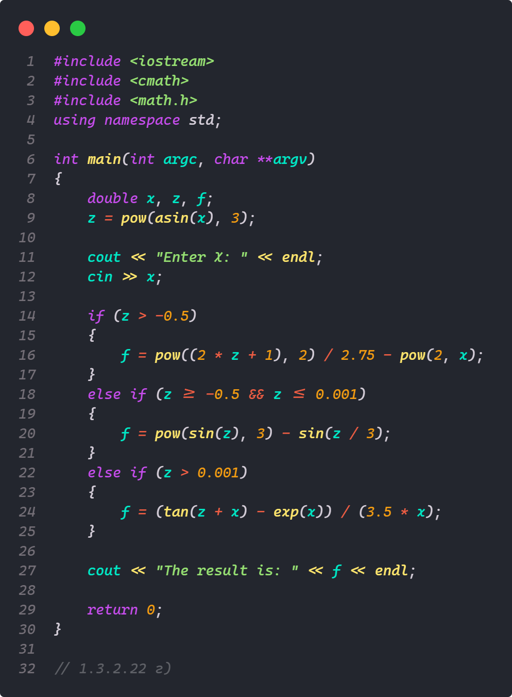
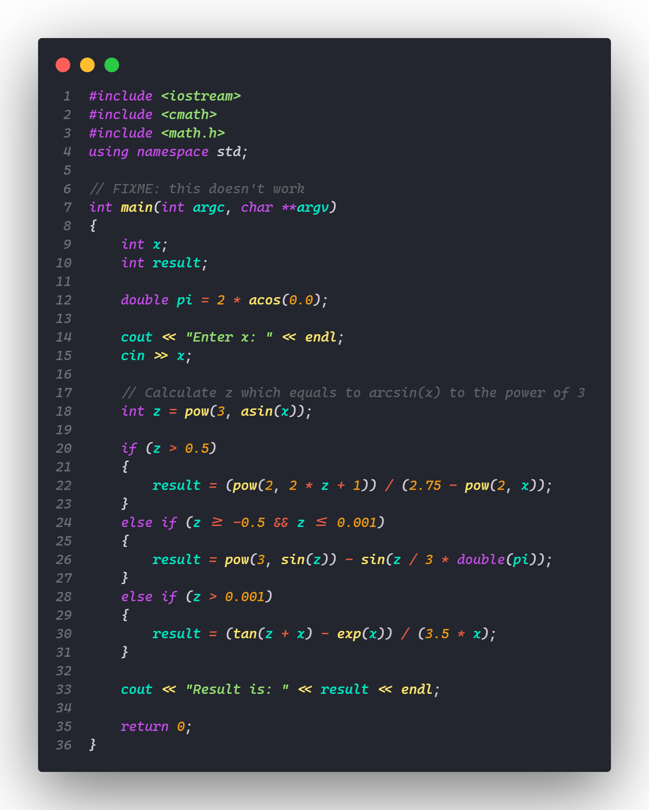

  

<h3 align="center">University Projects</h3>

---

 Folder with projects for University
     

## 📝 Table of Contents

- [📝 Table of Contents](#-table-of-contents)
- [🧐 About ](#-about-)
- [✨ Projects ](#-projects-)
- [⛏️ Built Using ](#️-built-using-)
- [✍️ Authors ](#️-authors-)
- [🎉 Acknowledgements ](#-acknowledgements-)

## 🧐 About 

Folder with projects for University. Mainly all of them will be made with C++ or C since those two languages are the main stack.

## ✨ Projects 

---

---

---

## ⛏️ Built Using 

- [C++](https://www.w3schools.com/cpp/default.asp) - Programming Language
- [C](https://www.w3schools.com/c/) - Programming Language

## ✍️ Authors 

- [@seesmof](https://github.com/seesmof) - Development
- [Національний Університет "Запорізька політехніка"](https://zp.edu.ua/) - Projects and Teaching
- [Кафедра Програмних засобів](https://pz.zp.ua/) - Projects and Teaching

## 🎉 Acknowledgements 

- [Національний Університет "Запорізька політехніка"](https://zp.edu.ua/) - for great educational programs and projects
- [Кафедра Програмних засобів](https://pz.zp.ua/) - for great educational programs and projects
