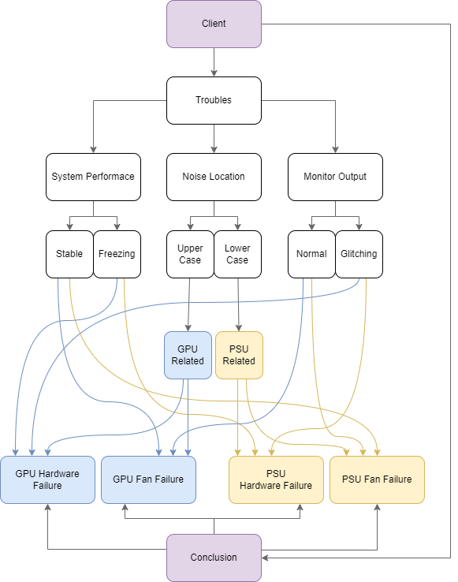

#### РОЗРОБКА СЕМАНТИЧНОЇ МЕРЕЖІ

**Назва предметної області**: діагностика несправностей комп’ютерів.

#### Мета роботи

Проблеми з комп’ютерним обладнанням стали поширеними завдяки поширенню подібного обладнання серед більшої кількості людей. Такі проблеми потребують наявності певної експертизи для їх діагностики та успішного відлагодження й усунення.

**Мета експертної системи** – встановити джерело проблеми за наданими параметрами несправності.

**Мета роботи** – Навчитися аналізувати й описувати предметну область у вигляді семантичної мережі.

#### Конкретизація вхідних та вихідних даних

Вхідними даними є опис несправностей у вигляді трьох параметрів – System Performance (Швидкодія системи), Noise Location (Місцезнаходження шуму), Monitor Output (Сигнал на монітор).

Експертна система призначена для ситуацій, коли клієнт має незрозумілий шум всередині системного блоку, але не може точно визначити джерело таких шумів.

Вихідними даними є джерело проблеми у клієнта.

#### Словник предметної області

| Event Name           | Entity Description                                                                                   | Attribute Name                                     | Attribute Valid Values                                      |
| -------------------- | ---------------------------------------------------------------------------------------------------- | -------------------------------------------------- | ----------------------------------------------------------- |
| Client               | A person who is having troubles with their PC hardware.                                              | Troubles, Conclusion                               |                                                             |
| Troubles             | A description of client's problem                                                                    | System Performance, Noise Location, Monitor Output | Stable, Freezing; Upper Case, Lower Case; Normal, Glitching |
| System Performance   | The client's system performance, measured as their subjective experience of working with the system. | Stable, Freezing                                   |                                                             |
| Stable               | System performance that seems stable to the user                                                     |                                                    |                                                             |
| Freezing             | System performance that works unstable - with freezing, be it constant or periodic                   |                                                    |                                                             |
| Noise Location       | The location of the noise that the user hears in the system.                                         | Upper Case, Lower Case                             |                                                             |
| Upper Case           | Strange noise that comes from somewhere around the upper part of computer case                       |                                                    |                                                             |
| Lower Case           | Strange noise that comes from somewhere around the lower part of computer case                       |                                                    |                                                             |
| Monitor Output       | Output of user's monitor or any screen they might have connected to the system                       | Normal, Glitching                                  |                                                             |
| Normal               | Monitor output that seems stable to the user - without any artifacts or sudden glitches              |                                                    |                                                             |
| Glitching            | Monitor output that glitches - suddenly shows arbitrary shapes, turns off, freezes, etc.             |                                                    |                                                             |
| GPU Hardware Failure | Computer problem that happens when GPU hardware fails.                                               |                                                    |                                                             |
| GPU Fan Failure      | Computer problem that happens when GPU fan fails.                                                    |                                                    |                                                             |
| PSU Hardware Failure | Computer problem that happens when PSU hardware fails.                                               |                                                    |                                                             |
| PSU Fan Failure      | Computer problem that happens when PSU fan fails.                                                    |                                                    |                                                             |
_Таблиця 1.1 – Словник предметної області_

#### Узагальнення

Узагальненим для різних значень, що надходять до семантичної мережі є наступні класи – GPU Related (Пов'язані з графічним процесором), PSU Related (Пов'язані з блоком живлення).

#### Сценарії

_Positive Scenario:_
If system performance is stable and noise location is upper case and monitor output is normal, then conclusion is GPU Fan Failure.

_Negative Scenario:_
If system performance is freezing and noise location is lower case and monitor output is normal, then conclusion is Unknown.

#### Схема семантичної мережі


_Рисунок 1.1 – Схема семантичної мережі_

#### Текст програми

Нижче наведено текст програми, що реалізує семантичну мережу за допомогою бібліотеки SNToolbox для пакету MATLAB:

```matlab
Folder_Path='E:\all\University\y2t2\DS\tasks\lb1\SNToolbox';
addpath(genpath(Folder_Path));

SN=SNnew;

SN=SNaddORnode(SN,'stable','freezing','upper','lower','normal','glitching');
SN=SNaddANDnode(SN,'client','troubles','system performance','noise location','monitor output','gpu related','psu related','gpu hardware failure','gpu fan failure','psu hardware failure','psu fan failure','conclusion');

SN=SNaddrelation(SN,'client','has','troubles');
SN=SNaddrelation(SN,'client','has','conclusion');
SN=SNaddrelation(SN,'troubles','type','system performance');
SN=SNaddrelation(SN,'troubles','type','noise location');
SN=SNaddrelation(SN,'troubles','type','monitor output');
SN=SNaddrelation(SN,'conclusion','type','gpu hardware failure');
SN=SNaddrelation(SN,'conclusion','type','gpu fan failure');
SN=SNaddrelation(SN,'conclusion','type','psu hardware failure');
SN=SNaddrelation(SN,'conclusion','type','psu fan failure');
SN=SNaddrelation(SN,'system performance','type','stable');
SN=SNaddrelation(SN,'system performance','type','freezing');
SN=SNaddrelation(SN,'noise location','type','upper');
SN=SNaddrelation(SN,'noise location','type','lower');
SN=SNaddrelation(SN,'monitor output','type','normal');
SN=SNaddrelation(SN,'monitor output','type','glitching');
SN=SNaddrelation(SN,'upper','include','gpu related');
SN=SNaddrelation(SN,'lower','include','psu related');
SN=SNaddrelation(SN,'gpu related','include','gpu hardware failure');
SN=SNaddrelation(SN,'gpu related','include','gpu fan failure');
SN=SNaddrelation(SN,'psu related','include','psu hardware failure');
SN=SNaddrelation(SN,'psu related','include','psu fan failure');

SNplot(SN,'hierarchy');
SNplot(SN,'circle');

SN1=SN;
SN1=SNdelnode(SN1,'freezing','lower','glitching','gpu related','psu related','gpu hardware failure','gpu fan failure','psu hardware failure','psu fan failure');
SN1=SNaddANDnode(SN1,'?');
SN1=SNaddrelation(SN1,'conclusion','type','?');
figure;
SNplot(SN1,'random');
Res=SNfind(SN,SN1);
Res;

SN2=SN;
SN2=SNdelnode(SN2,'freezing','lower','normal','gpu related','psu related','gpu hardware failure','gpu fan failure','psu hardware failure','psu fan failure');
SN2=SNaddANDnode(SN2,'?');
SN2=SNaddrelation(SN2,'conclusion','type','?');
figure;
SNplot(SN2,'random');
Res=SNfind(SN,SN2);
Res;

SN3=SN;
SN3=SNdelnode(SN3,'stable','upper','normal','gpu related','psu related','gpu hardware failure','gpu fan failure','psu hardware failure','psu fan failure');
SN3=SNaddANDnode(SN3,'?');
SN3=SNaddrelation(SN3,'conclusion','type','?');
figure;
SNplot(SN3,'random');
Res=SNfind(SN,SN3);
Res;
```

#### Результати роботи програми

Нижче наведено повідомлення з командного вікна після виконання програми у пакеті MATLAB:


#### Висновки

Таким чином, ми навчилися аналізувати й описувати предметну область у вигляді семантичної мережі.

#### Контрольні запитання

##### Поняття інтелектуальної системи

Інтелектуальна система - система для вирішення інтелектуальних задач 

Інтелектуальна задача - задача де чіткого алгоритму нема 

##### Властивості інтелектуальних систем

Властивості інтелектуальних систем називають властивостями інтелектуальності:
- наявність власної моделі оточуючого середовища
- здатність до навчання
- здатність аналізувати ситуації
- здатність виконувати щось віддалено схоже на людське мислення
- здатність приймати рішення при неповній інформації
- здатність до адаптації

##### Характеристика систем, заснованих на знаннях

Система заснована на знаннях то є система Програмного Забезпечення, що складається з Бази Знань та Механізму Логічного Виведення. До такої системи входять модулі Підсистеми Набуття Знань, Підсистеми Пояснень та Інтерфейсної Підсистеми

##### Архітектура експертної системи

Оптимальне компонування експертної системи містить Машину Логічного Виведення, Базу Знань, Підсистему Набуття Знань, Підсистему Пояснення Рішень, Інтерфейсну Підсистему, Робочу Пам'ять.

##### Поняття знання

Знання це структурована інформація виведена з суб'єктивного досвіду людини у світі і корисна для вирішення задач у заданій предметній області.

##### Відміна знань від даних

Дані не є стркутурованими (або систематизованими), як знання, але є сукупністю фактів.

##### Поняття екстенсіоналу та інтенсіоналу

Екстенсіонал то є множина відношень, де саме відношення представлене у вигляді Атрибут- Значення. Щось схоже на словник у програмуванні

Інтенсіонал це сукупність пар у вигляді Атрибут - Всі Значення Атрибута. Щось схоже на словник вигляду Атрибут: Масив Значень

##### Загальні відомості про моделі представлення знань

Модель представлення знань то є по суті спосіб опису і подання знань у нашій системи. Бувають декларативними або процедурними.

##### Поняття семантичної мережі

Семантична мережа то є граф де вершина це поняття, а дуга це відношення між поняттями.

##### Формалізація семантичної мережі

Формалізація то є перетворення наявних знань у формальну форму визначень.

Формалізація семантичної мережі то є перегляд наявних подань і можливе реформування цих понять.

##### Прості та ієрархічні мережі

Прості мережі то є такі, у яких вершини не мають власної структури, а ієрархічні то є такі, де вершини складають свою структуру у вигляді мереж.

##### Основні типи об'єктів та зв'язків між ними

Існують три типи:
- Поняття то є постійні елементи системи, часто іменники
- Властивості то є характеристики (або атрибути) понять
- Події то є дії в предметній області

##### Види семантичних відношень

Існують такі види семантичних відношень:
- лінгвістичні - час, вага, колір
- логічні - імплікація, заперечення, диз'юнкція
- теоретико-множинні - клас-підклас, підмножина, близькість
- квантифікаційні - існування, багато, кілька

##### Модифікація баз знань на семантичних мережах

В більшості випадків комерційні системи використовують Базу Даних Бази Знань з Локальним Індексуванням ✝️💗🙏

##### Операція порівняння із зразком

Для порівняння зазвичай використовуються такі критерії:
- формалізованість - різні види мереж
- можливість поповнення - предикати, фрейми, тощо
- нотаційна адекватність - синтаксична будова моделі
- відображення семантики предметної області - фрейми, предикати, тощо
- інференційні можливості - мережі, фрейми, логіки

##### Яким чином виконується подання знань в семантичній моделі?

Для подання знань в семантичній мережі необхідно формалізувати наявні знання, відокремивши такі для комп'ютера і для людини, а тоді побудувати модель подання знань.

##### Для чого використовується операція порівняння із зразком в семантичній мережі?

Операція порівняння зі зразком у семантичній мережі використовується для визначення релевантності кожного відношення у фреймі.

##### Принципи наслідування інформації в мережній моделі?

Якшо OR-вузол має лише один батьківський вузол, то він не буде наслідувати його істинність.

##### Які основні типи об’єктів і відношень між ними в семантичній мережі є обов’язкові?

Обов'язковими типами об'єктів та відношень у семантичній мережі є категоризаційна ієрархія, правила успадкування, супертип та всі їхні підтипи.

##### Як здійснюється пошук інформації в мережній базі знань?

Пошук зазвичай являє собою перебір великої кількості різних варіянтів рішень, кожне з яких співставляється відповідно.

##### Назвіть переваги та недоліки семантичної мережі

Недоліками семантичної мережі є:
- складність пошуку
- відсутність денотації та систематики
- погане подання структурних відношень
- менш системачна мережа з логікою

##### За допомогою яких відношень в мережі можна виразити ієрархію об’єктів?

Наступні відношення можуть бути використані для відображення ієрархії об'єктів:
- ієрархія
- причина-наслідок
- частина

##### Однорідна та неоднорідна мережа, дискретна мережа. Що їх відрізняє?

- Однорідна мережа має лише один тип відношень
- Неоднорідна мережа має різні типи відношень
- Дискретна мережа то є мережа, де як вузли, так і ребра можна вважати дискретними об'єктами

##### Що зветься сценарієм?

Сценарій це структуроване подання яке корисне для опису ситуацій та розумінні природної мови.

##### Бібліотека SNToolbox для моделювання семантичних мереж у пакеті MATLAB

Бібліотека SNToolbox то є бібліотека для MATLAB для роботи з семантичними мережами.